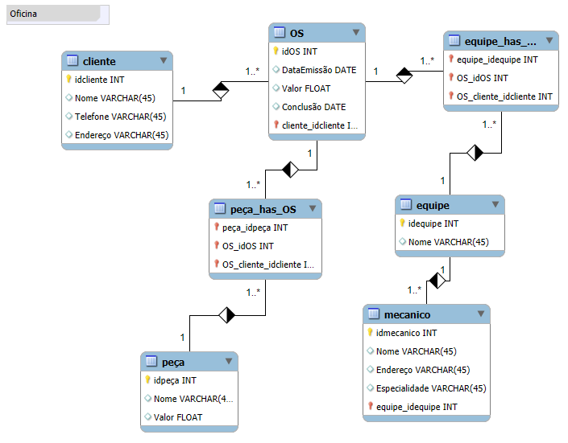

## DIO - Diagrama

- Diagrama feito como atividade do curso de ciência de dados pela DIO.
- Abaixo está um diagrama feito para o relacionamento entre tabelas sobre uma oficina fictícia.
- O **Language Studio** é extremamente eficaz para automatizar a análise de sentimentos e o reconhecimento de padrões em grandes volumes de texto.
- A integração dos dois serviços pode resultar em aplicações completas de voz e linguagem, como assistentes virtuais e bots inteligentes.

### **Objetivo:**

Cria o esquema conceitual para o contexto de oficina com base na narrativa fornecida

### **Narrativa:**

-   Sistema de controle e gerenciamento de execução de ordens de serviço em uma oficina mecânica
-   Clientes levam veículos à oficina mecânica para serem consertados ou para passarem por revisões periódicas
-   Cada veículo é designado a uma equipe de mecânicos que identifica os serviços a serem executados e preenche uma OS com data de entrega.
-   A partir da OS, calcula-se o valor de cada serviço, consultando-se uma tabela de referência de mão-de-obra
-   O valor de cada peça também irá compor a OSO cliente autoriza a execução dos serviços
-   A mesma equipe avalia e executa os serviços
-   Os mecânicos possuem código, nome, endereço e especialidade
-   Cada OS possui: n°, data de emissão, um valor, status e uma data para conclusão dos trabalhos.

